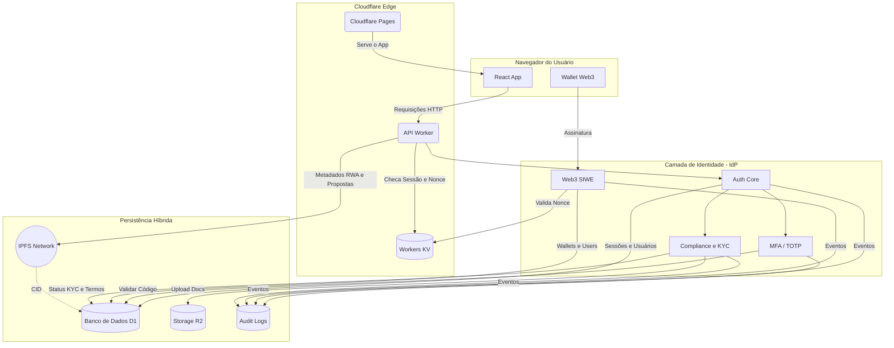

# 🚀 Governance System: Identidade e Governança Institucional


O Governance System é uma plataforma de governança institucional e identidade digital, projetada para operar em cenários de DAO, Web3 e RWA (Real World Assets).

---

## 📑 Índice de Navegação

> **Onde você quer ir hoje?** Navegue pelas seções oficiais da documentação da ASPPIBRA DAO classificadas por domínio técnico.

### 🏛️ 1. Arquitetura e Visão

_Fundamentos, escolhas tecnológicas (Jamstack/Edge) e topologia da rede._

- [1. Introdução](#1-introdução)
- [2. Visão Geral do Sistema](#2-visão-geral-do-sistema)
- [3. Arquitetura Geral](#3-arquitetura-geral)
- [4. Stack Tecnológica](#4-stack-tecnológica)
- [12. Diagrama de Arquitetura](#12-diagrama-de-arquitetura)

### 🔐 2. Identidade e Segurança (IdP)

_O coração soberano do sistema. Zero-Trust, Shadow Accounts e Controle de Níveis._

- [5. Identidade como Núcleo do Sistema](#5-identidade-como-núcleo-do-sistema)
- [6. Authentication Assurance Levels (AAL)](#6-authentication-assurance-levels-aal)
- [7. Fluxos de Autenticação e Credenciais](#7-fluxos-de-autenticação-e-credenciais)
- [10. Auditoria, Logs e Compliance](#10-auditoria-logs-e-compliance)
- [11. Modelo de Ameaças (STRIDE)](#11-modelo-de-ameaças-stride)

### 🌐 3. Conectividade e Governança

_Integração de Web3 (SIWE), provedores sociais e gestão DAO descentralizada._

- [8. Arquitetura de Integração Web3](#8-arquitetura-de-integração-web3)
- [9. Estratégia Híbrida de Dados](#9-estratégia-de-dados)
- [16. O Ciclo de Vida da Proposta (Governance)](#16-governança-o-ciclo-de-vida-da-proposta)

### 💻 4. Guia de Desenvolvimento

_Materiais de referência para desenvolvedores consumirem e codarem na API._

- [13. Estrutura do Repositório](#13-estrutura-do-repositório)
- [14. Configuração e Setup](#14-configuração-e-setup)
- [15. Status do Projeto](#15-status-do-projeto)
- [17. API Reference (Endpoints Principais)](#17-api-reference-endpoints-principais)
- [18. Glossário de Termos](#18-glossário-de-termos)
- [19. Guia de Contribuição](#19-guia-de-contribuição)
- [20. Considerações Finais](#20-considerações-finais)
- [21. Inteligência Artificial & Agentes](#21-inteligência-artificial--agentes)

---

## 1. Introdução

### 1.1. Governance System

O Governance System é uma plataforma de governança institucional e identidade digital, projetada para operar em cenários de DAO, Web3 e RWA (Real World Assets).

### 1.2. Objetivo do Projeto

Mais do que um sistema de votação ou gestão administrativa, este projeto implementa um Identity Provider (IdP) soberano, com segurança de nível financeiro, compliance jurídico e rastreabilidade completa.

### 1.3. Contextos de Uso

- 🏛️ Sustentar governança descentralizada (DAO)
- 🌱 Operar em contextos de cooperativismo
- 🧾 Atender requisitos de compliance e auditoria
- 🦊 Integrar identidade Web3 (SIWE) com Web2 tradicional
- 🛡️ Garantir segurança bancária (MFA, sessões rastreáveis)

## 2. Visão Geral do Sistema

### 2.1. Princípios de Design

O sistema foi concebido para priorizar latência mínima, escalabilidade global e simplicidade operacional.

### 2.2. Escopo Institucional

A plataforma é desenhada para suportar operações que exigem um alto grau de confiança e verificação, adequadas para ambientes corporativos e regulados.

### 2.3. Execução em Edge Computing

Toda a arquitetura roda no edge da Cloudflare, garantindo performance e segurança distribuídas globalmente.

## 3. Arquitetura Geral

### 3.1. Padrão Arquitetural

O Governance System utiliza uma arquitetura Jamstack + Edge Computing, com separação clara entre interface, identidade, governança e persistência de dados.

### 3.2. Separação de Camadas

A arquitetura é dividida em camadas lógicas para garantir manutenibilidade e escalabilidade.
_ **Interface (Front-end):** SPA em React + TypeScript.
_ **Edge / Backend:** Cloudflare Workers como API serverless.
_ **Identidade (IdP):** Núcleo de autenticação e autorização.
_ **Governança:** Módulos de votação e gestão. \* **Persistência de Dados:** Solução híbrida com D1, R2 e IPFS.

## 4. Stack Tecnológica

#### 4.1. Front-end

- SPA em React + TypeScript
- Material-UI (MUI) para UI responsiva e acessível

#### 4.2. Edge & Backend

- **Vercel** para servir o front-end Next.js (`www.finalfightcombat.xyz`)
- Cloudflare Workers como API serverless (`api.finalfightcombat.xyz`)
- Cloudflare KV (Workers KV) para cache de ultra-baixa latência:
  - Nonces de autenticação (SIWE)
  - Sessões revogadas
  - Preços e estados temporários de ativos (RWA)

#### 4.3. Identidade & Segurança

- **Identidade Soberana (SSI):** Baseada em pares de chaves Ed25519.
- **DID Resolver:** did:ffc:<username>.
- **MFA / TOTP (Google Authenticator, Authy, etc.):** Nível AAL2.
- **Zero-Trust:** Middleware de assinatura criptográfica para rotas sensíveis.

#### 4.4. Persistência Híbrida

- Cloudflare D1 (SQLite serverless): dados relacionais, perfis, sessões e logs
- Cloudflare R2 (Object Storage): documentos KYC e arquivos privados
- IPFS (InterPlanetary File System): metadados imutáveis de ativos RWA e propostas da DAO

#### 4.5. Auditoria e Observabilidade

- **Cloudflare Workers Logs:** Monitoramento analítico nativo persistente configurado em produção.
- **Cloudflare Traces:** (Tracing Ativado para 100% das amostras de rede via Edge).
- Logs forenses criptográficos locais controlados pela classe `AuditService`.
- Trilhas auditáveis prontas para compliance e auditorias robustas.

## 5. Identidade como Núcleo do Sistema

### 5.1. Conceito de Identidade Soberana

A identidade é o eixo central da arquitetura. Todas as ações — governança, votos, movimentações, permissões — partem de um usuário autenticado, auditável e com nível de garantia de autenticação (AAL) conhecido.

### 5.2. Tipos de Conta (A Arquitetura "Shadow Users")

Para suportar o cruzamento de identidades Web3 rigorosas e identidades sociais sem destruir a formatação do banco relacional, utilizamos o ecossistema de **Shadow Identities**.

- **Contas Tradicionais:** E-mail normal + senha
- **Contas Web3 (SIWE):** O backend recebe a assinatura EIP-4361, identifica a carteira (usando `viem`) e forja um e-mail falso tipo `0xabc@web3.local` no Drizzle (inserindo também na tabela `wallets`).
- **Contas OAuth (Google/GitHub):** Recebe o Callback oficial e realiza _Upsert_ instantâneo preenchendo todos os dados perfeitamente de volta para o JWT.
- **Vantagem:** Nativos, Cripto e Sociais operam sob as mesmas permissões (Roles de Cidadão) nas rotas de Governância sem duplicidade.

### 5.3. Rastreabilidade e Auditoria de Ações

Todas as ações críticas geram logs forenses, garantindo uma trilha auditável completa.

## 6. Authentication Assurance Levels (AAL)

### 6.1. Definição de AAL

O sistema adota níveis formais de garantia de autenticação, permitindo controle de risco e governança baseada em identidade.

### 6.2. Níveis de Garantia de Autenticação

| Nível | Descrição                | Requisitos                                    |
| :---- | :----------------------- | :-------------------------------------------- |
| AAL1  | Identidade Digital       | Cadastro de Username + Chave Pública          |
| AAL2  | Identidade Forte         | Username + Chave Pública + MFA/TOTP           |
| AAL3  | Identidade Institucional | AAL2 + KYC Aprovado + Prova de Documento (R2) |

Cada ação sensível (voto, emissão de ativo, proposta, admin) exige um AAL mínimo configurável.

## 7. Fluxos de Autenticação e Credenciais

#### 7.1. Registro Inicial (Handshake Gênese)

1. Usuário gera par de chaves Ed25519 (Seed/Mnemonic).
2. Solicita um Challenge (Nonce) ao Worker.
3. Envia Assinatura do Nonce + Chave Pública para registro do DID.

#### 7.2. Verificação de Email

- Token de verificação com expiração curta é enviado ao email do usuário.

#### 7.3. Criação e Gerenciamento de Sessão

- JWT de curta duração.
- Refresh token com rotação obrigatória (one-time-use).

#### 7.4. MFA / TOTP

- Geração de segredo TOTP via rota `/api/core/identity/totp/setup`.
- Validação no login para elevação a AAL2.

#### 7.5. Integração Web3 (SIWE - Sign-In With Ethereum)

- Rota autônoma de geração de desafio contra Replays via nonces temporários limitados pelo (Workers KV: `TTL 600s`).
- Verificação criptográfica completa (Ed25519/Secp256k1) no Backend usando o validador nativo `viem` de altíssima performance.

#### 7.6. Integração Flow Social (OAuth 2.0) ✅ Em Produção

- Gerenciamento Edge via Hono Server das chamadas Callback Client-Side (Google e GitHub).
- Sem requerer dependências massivas do NodeJS (substituindo passport.js por chamamentos limpos com APIs nativas).
- **Domínio Principal Frontend:** `https://www.finalfightcombat.xyz` (variável `FRONTEND_URL`)
- **GitHub OAuth App:** ASPPIBRA DAO (App ID: 3539539) — qualquer usuário GitHub pode autenticar.
- **Google OAuth:** Totalmente configurado com callback URI e pronto para produção.

| Provedor | Login URL             | Callback URL             | Status      |
| -------- | --------------------- | ------------------------ | ----------- |
| GitHub   | `/oauth/github/login` | `/oauth/github/callback` | ✅ Produção |
| Google   | `/oauth/google/login` | `/oauth/google/callback` | ✅ Produção |

#### 7.6. Elevação de Garantia (KYC – AAL3)

- Upload de documentos para bucket R2.
- Vinculação com a identidade soberana no D1.

## 8. Arquitetura de Integração Web3

_Esta seção detalha a integração com o ecossistema Web3, incluindo a gestão de carteiras e a validação de assinaturas._

## 9. Estratégia de Dados

### 9.1. Visão Geral da Estratégia Híbrida

O sistema adota uma estratégia que equilibra privacidade, performance e transparência pública.

### 9.2. Dados Sensíveis (Privados)

- **O quê:** Emails, senhas, documentos pessoais e status KYC.
- **Tecnologia:** Cloudflare D1 + R2.
- **Proteção:** Criptografados e protegidos por controle de acesso.

### 9.3. Dados de Performance (Edge Cache)

- **O quê:** Sessões revogadas, nonces de login Web3, cotações e estados temporários de ativos.
- **Tecnologia:** Cloudflare Workers KV.

### 9.4. [ROADMAP] Dados Públicos e Imutáveis

- **O quê:** Metadados de ativos RWA, propostas e resultados finais de votações.
- **Tecnologia:** IPFS (Placeholder atual).
- **Garantia:** Geração de CIDs para prova de imutabilidade.

### 9.5. Backup e Recuperação de Desastres

A integridade dos dados é garantida por uma política de backup robusta. O Cloudflare D1 oferece replicação automática e backups contínuos. Adicionalmente, metadados críticos (como CIDs do IPFS referentes a propostas e ativos) são espelhados em logs de auditoria, permitindo a reconstrução do estado de governança a partir de fontes imutáveis em um cenário de falha catastrófica.

## 10. Auditoria, Logs e Compliance

_Esta seção descreve a estratégia para garantir a rastreabilidade completa das ações e a conformidade com requisitos regulatórios._

## 11. Modelo de Ameaças (STRIDE)

| Categoria                  | Mitigação                                |
| :------------------------- | :--------------------------------------- |
| **S**poofing               | MFA, SIWE, verificação de email          |
| **T**ampering              | IPFS (imutabilidade), hash criptográfico |
| **R**epudiation            | Logs forenses e trilhas auditáveis       |
| **I**nformation Disclosure | Criptografia, segregação de dados        |
| **D**enial of Service      | Rate limiting, edge caching              |
| **E**levation of Privilege | AAL mínimo por ação, roles explícitos    |

## 12. Diagrama de Arquitetura



## 13. Estrutura do Repositório

````
src/
├── db/
│   └── schema.ts            # Citizens, Users, Posts, Audit Logs
├── routes/
│   ├── core/
│   │   ├── identity/        # Handshake, Login, MFA, DID, Audit logs
│   │   ├── health.ts        # Healthcheck
│   │   └── compliance.ts    # KYC Status
│   ├── platform/
│   │   ├── payments.ts      # Placeholders
│   │   └── storage.ts       # IPFS Placeholder
│   └── products/
│       ├── agro/
│       ├── rwa/
│       ├── exchange/      # Cripto/Binance API Integration
│       └── real-estate/   # Real Estate Data & Pipeline (14 Tables)
├── services/
│   └── audit.ts             # Logger de auditoria nativo
└── middleware/
    └── auth_signature.ts    # Middleware Zero-Trust de assinatura
\`\`\`

## 14. Configuração e Setup

### 14.1. Pré-requisitos
- Node.js v24+
- pnpm v8.x+ (Padrão de Pipeline)
- Wrangler CLI

### 14.2. Automação CI/CD (GitHub Actions)
O sistema possui uma esteira Zero-Trust blindando a branch principal. Todo commit ativará o workflow (.github/workflows/ci.yml) executando:
1. `tsc --noEmit` (Proteção Estrita de Tipagem).
2. `vitest run` injetando Mockups reais do Contexto Hono e D1.

### 14.2. Variáveis de Ambiente (`.dev.vars`)

Copie o arquivo `.dev.vars.example` e preencha com seus valores. As variáveis obrigatórias são:

```bash
# JWT
JWT_SECRET=your_jwt_secret_min_32_chars

# OAuth 2.0
GOOGLE_CLIENT_ID=xxx.apps.googleusercontent.com
GOOGLE_CLIENT_SECRET=your_google_secret
GITHUB_CLIENT_ID=Ov23livICWWp9TNsFa5Y
GITHUB_CLIENT_SECRET=your_github_secret

# Frontend redirect após OAuth
FRONTEND_URL=https://www.finalfightcombat.xyz

# Serviços externos (Binance, Moralis, R2, etc.)
# Ver lista completa de 24 variáveis no .dev.vars do repositório
````

> ⚠️ **Nunca** commite o `.dev.vars` — está no `.gitignore`. Em produção, use `wrangler secret put NOME_DA_VAR`.

## 15. Status do Projeto

🟢 **Infraestrutura de Identidade Consolidada** — Autenticação híbrida (Social, Web3, SSI) 100% operacional e auditada. Pronta para ambientes regulados e DAOs.

## 16. Governança: O Ciclo de Vida da Proposta

O sistema foi projetado para dar suporte completo ao ciclo de vida de uma proposta de governança na DAO:

1.  **Criação:** Um membro com o AAL e o role adequados cria uma nova proposta, detalhando a ação e seus metadados.
2.  **Publicação Imutável:** O conteúdo da proposta é publicado no IPFS, gerando um CID (Content Identifier) que garante sua imutabilidade.
3.  **Registro On-chain (Opcional):** O CID pode ser registrado em um Smart Contract para prova de existência.
4.  **Votação:** Membros qualificados votam na proposta. Os votos são registrados de forma segura no D1.
5.  **Tally & Execução:** Ao final do período de votação, o resultado é apurado. Se aprovada, a ação correspondente é executada pelo sistema.

## 17. API Reference (Endpoints Principais)

**🚀 Domínio Oficial de Produção:** `https://api.finalfightcombat.xyz`  
_(Gerenciado estruturalmente através do Custom Domain Cloudflare no wrangler.toml)._

A documentação completa da API será disponibilizada via Swagger/OpenAPI. Abaixo, um resumo dos endpoints essenciais:

| Verbo  | Endpoint                                       | Descrição                                               | AAL Mín. |
| :----- | :--------------------------------------------- | :------------------------------------------------------ | :------- |
| `GET`  | `/api/core/identity/challenge/:u`              | Obtém nonce para handshake W3C.                         | Open     |
| `POST` | `/api/core/identity/register`                  | Registro via assinatura Ed25519 pura.                   | Open     |
| `POST` | `/api/core/identity/login`                     | Login ZK-Handshake normal.                              | Open     |
| `GET`  | `/api/core/identity/me`                        | Valida JWT e retorna dados do usuário (dual OAuth/SSI). | Bearer   |
| `GET`  | `/api/core/identity/web3/nonce`                | Obtém UUID para assinatura de Carteira EIP-4361.        | Open     |
| `POST` | `/api/core/identity/web3/verify`               | Verifica criptografia e injeta Shadow Account.          | Open     |
| `GET`  | `/api/core/identity/oauth/google/login`        | Inicia fluxo OAuth Google (redirect).                   | Open     |
| `GET`  | `/api/core/identity/oauth/google/callback`     | Callback Google → gera JWT → redirect frontend.         | Open     |
| `GET`  | `/api/core/identity/oauth/github/login`        | Inicia fluxo OAuth GitHub (redirect).                   | Open     |
| `GET`  | `/api/core/identity/oauth/github/callback`     | Callback GitHub → gera JWT → redirect frontend.         | Open     |
| `POST` | `/api/core/identity/local/register`            | Cria uma identidade manualmente (PBKDF2 WebCrypto)      | Open     |
| `POST` | `/api/core/identity/local/login`               | Executa a colisão Criptográfica e Autentica.            | Open     |
| `POST` | `/api/core/identity/local/forgot-password`     | Inicia fluxo anti-enumeração de reset via Token.        | Open     |
| `POST` | `/api/core/identity/local/reset-password`      | Valida Token de 1 Hora e altera Hash do Banco.          | Open     |
| `GET`  | `/api/core/identity/did/:id`                   | Resolve documento DID W3C.                              | Open     |
| `GET`  | `/api/posts`                                   | Lista posts do Blog (Paginação & Filtro).               | Open     |
| `GET`  | `/api/posts/:slug`                             | Detalhes do Post por Slug.                              | Open     |
| `POST` | `/api/posts`                                   | Cria um novo post (Blog/SocialFi).                      | AAL1     |
| `PUT`  | `/api/posts/:id`                               | Atualiza post existente.                                | AAL1     |
| `DELETE`| `/api/posts/:id`                               | Remove post do Blog.                                    | AAL1     |
| `POST` | `/api/platform/storage/upload`                 | Upload de Mídia (R2) para Blog e KYC.                   | AAL1     |
| `POST` | `/api/posts/:id/favorite`                      | Alterna Favorito em um post.                            | AAL1     |
| `GET`  | `/api/posts/:id/comments`                      | Lista comentários de um post.                           | Open     |
| `POST` | `/api/posts/:id/comments`                      | Adiciona comentário a um post.                          | AAL1     |
| `GET`  | `/api/products/real-estate`                    | Lista imóveis (Real Estate).                            | Open     |
| `POST` | `/api/products/real-estate`                    | Cadastra novo imóvel (Real Estate).                     | AAL1     |
| `GET`  | `/api/products/exchange/binance/price/:symbol` | Cotação da corretora em tempo real (Binance).           | Open     |
| `GET`  | `/api/products/exchange/binance/balance`       | Saldo da conta usando API Keys HMAC criptografadas.     | AAL1     |
| `POST` | `/api/core/identity/totp/setup`                | Habilita MFA via TOTP.                                  | AAL1     |
| `POST` | `/api/core/compliance`                         | Verifica status KYC.                                    | AAL1     |
| `GET`  | `/api/core/health`                             | Status da infraestrutura.                               | Open     |

## 18. Glossário de Termos

| Termo    | Descrição                                                                                                                                                |
| :------- | :------------------------------------------------------------------------------------------------------------------------------------------------------- |
| **AAL**  | (Authentication Assurance Level) Nível de garantia de autenticação que mede a força da identidade de um usuário.                                         |
| **SIWE** | (Sign-In with Ethereum) Padrão que permite a autenticação de usuários usando suas carteiras Ethereum, provando controle sobre a chave privada.           |
| **RWA**  | (Real World Asset) Ativo do mundo real (imóveis, contratos, etc.) que é tokenizado e representado digitalmente na blockchain ou em um sistema como este. |
| **CID**  | (Content Identifier) Endereço único e imutável de um arquivo na rede IPFS, gerado a partir do seu conteúdo.                                              |
| **DAO**  | (Decentralized Autonomous Organization) Organização governada por regras codificadas em smart contracts e controlada por seus membros.                   |

## 19. Guia de Contribuição

Este projeto acolhe contribuições da comunidade FFC. Para garantir a qualidade e a consistência do código, por favor, siga as diretrizes detalhadas no arquivo `CONTRIBUTING.md`. O guia inclui informações sobre padrões de código, fluxo de Pull Request e configuração do ambiente de desenvolvimento.

## 20. Considerações Finais

Este repositório implementa um núcleo soberano de identidade e governança institucional para Web2 + Web3.

---

## 21. Inteligência Artificial & Agentes

O Governance System integra uma camada de inteligência artificial nativa (Cloudflare Workers AI) para automatizar a criação de conteúdo, monitoramento de notícias e auditoria de segurança.

### 21.1. Modelos Integrados (Esquadrão de Elite)

| Função | Modelo de IA | Aplicação |
| :--- | :--- | :--- |
| **Escrita Criativa** | `@cf/meta/llama-3.1-8b-instruct` | Geração de posts, artigos e comunicações oficiais. |
| **SEO & Metadados** | `@cf/meta/llama-3.2-3b-instruct` | Análise de tags, títulos e descrições otimizadas. |
| **Segurança & Auditoria**| `@cf/meta/llama-guard-3-8b` | Revisão de segurança e filtro de conteúdo impróprio. |
| **Imagens de Capa** | `@cf/black-forest-labs/flux-1-schnell`| Geração de imagens exclusivas e fotorrealistas. |
| **Acessibilidade** | `@cf/llava-hf/llava-1.5-7b-hf` | Geração automática de Alt-Text (descrição de imagem). |
| **Tradução Global** | `@cf/meta/m2m100-1.2b` | Internacionalização de conteúdo (EN/ES/PT). |

### 21.2. Arquitetura de Agentes (Roles)

A lógica de operação é dividida em agentes especializados que operam em uma "Linha de Montagem Digital":

1.  **O Observador (Intelligence)**: Monitora portais de notícias e tendências em tempo real, eliminando alucinações via cruzamento de fontes.
2.  **O Estrategista (SEO)**: Planeja a estrutura de busca e impacto antes da escrita.
3.  **O Redator (Creative)**: Transforma pautas brutas em conteúdo HTML refinado.
4.  **O Curador Visual (Design)**: Cria a identidade visual e metadados de imagem.
5.  **O Auditor (Compliance)**: Realiza a revisão final, verifica fake news e atribui uma nota de qualidade (Score) ao post.

### 21.3. Fluxo de Operação Autônomo

O sistema opera sob dois gatilhos:
- **Manual**: Via Dashboard (Geração por demanda).
- **Scheduled (Cron)**: Janelas de monitoramento automático que sugerem pautas baseadas em eventos reais do mundo.

Todas as gerações de IA são registradas no `AuditService` para rastreabilidade completa.
